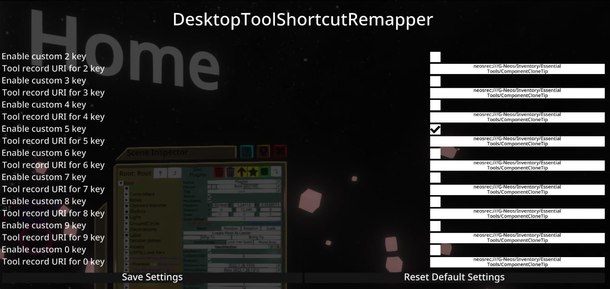

# DesktopToolShortcutRemapper

A [NeosModLoader](https://github.com/zkxs/NeosModLoader) mod for [Neos VR](https://neos.com/) that remaps numeric keys to spawn custom tools using the mod configuration.



Example tool URIs:

```
neosrec:///G-Neos/Inventory/Essential Tools/CharacterColliderSetterTip
neosrec:///G-Neos/Inventory/Essential Tools/ColorTip
neosrec:///G-Neos/Inventory/Essential Tools/ComponentCloneTip
neosrec:///G-Neos/Inventory/Essential Tools/Desktop LogixTip
neosrec:///G-Neos/Inventory/Essential Tools/DevToolTip
neosrec:///G-Neos/Inventory/Essential Tools/GeometryLineBrushTip
neosrec:///G-Neos/Inventory/Essential Tools/GlueTip
neosrec:///G-Neos/Inventory/Essential Tools/GrabbableSetterTip
neosrec:///G-Neos/Inventory/Essential Tools/LabelerTip
neosrec:///G-Neos/Inventory/Essential Tools/LightTip
neosrec:///G-Neos/Inventory/Essential Tools/LogixTip
neosrec:///G-Neos/Inventory/Essential Tools/MaterialTip
neosrec:///G-Neos/Inventory/Essential Tools/MeshTip
neosrec:///G-Neos/Inventory/Essential Tools/MeshVisibilityToggleTip
neosrec:///G-Neos/Inventory/Essential Tools/MeterTip
neosrec:///G-Neos/Inventory/Essential Tools/Microphone
neosrec:///G-Neos/Inventory/Essential Tools/ShapeTip
```

Relevant Neos issue: [#2412](https://github.com/Neos-Metaverse/NeosPublic/issues/2412).

## Installation
1. Install [NeosModLoader](https://github.com/zkxs/NeosModLoader).
2. Place [DesktopToolShortcutRemapper.dll](https://github.com/zkxs/NeosDesktopToolShortcutRemapper/releases/latest/download/DesktopToolShortcutRemapper.dll) into your `nml_mods` folder. This folder should be at `C:\Program Files (x86)\Steam\steamapps\common\NeosVR\nml_mods` for a default install. You can create it if it's missing, or if you launch the game once with NeosModLoader installed it will create the folder for you.
3. Start the game. If you want to verify that the mod is working you can check your Neos logs.

## Known Issues

Sometimes the tool won't spawn the first time you try. I have no idea why this happens. A workaround is to just press different keys until the tool loads once, after which it works consistently.
